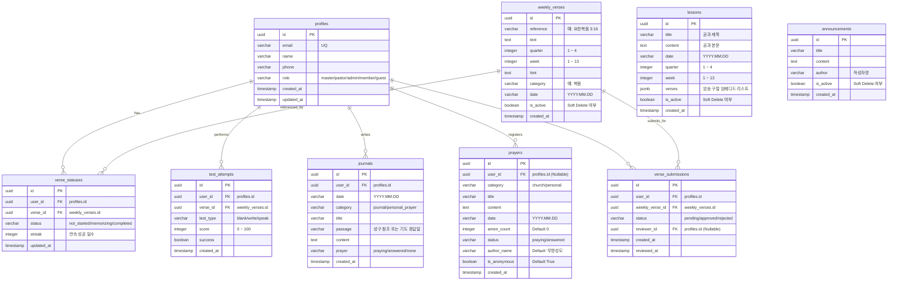

# 만나 (Manna) 데이터베이스 ERD & 설계 명세서

본 문서는 예수교장로회 한국총공회 학장교회의 말씀 암송 및 양육 시스템인 **만나(Manna)**의 데이터베이스 물리 모델(ERD) 및 운영 권한 관리 명세서입니다. 앞으로 진행되는 모든 개발과 스프린트의 기준 참조 문서로 사용됩니다.

---

## 1. 개요 (Overview)

만나 시스템의 데이터 모델은 크게 **사용자 및 권한**, **양육 콘텐츠 (성구/공과/공지)**, **수행 기록 및 소통 (성도 진도율/기도/제출)** 영역으로 구성됩니다. 장기적이고 안전한 교회 행정 운영을 지원하기 위해 다음 원칙이 적용됩니다:

1. **데이터 보존 극대화**: `DELETE` 및 `DROP` 방지 정책과 물리적 삭제를 대체하는 비활성화 필드 기반 Soft Delete 구조 지원.
2. **명확한 역할 분담 (RBAC)**: Master, Pastor, Admin, Member, Guest 역할을 구분하며 이에 따른 행위 권한 제한.
3. **영속성 및 연도별 확장성**: 성구와 공과의 연도별/분기별 조회 및 Seed 관리가 가능한 스키마 설계.

---

## 2. 물리 ERD (Entity-Relationship Diagram)

---

## 3. 테이블 명세 (Tables Dictionary)

### 3.1. `profiles` (사용자 프로필)
- **설명**: 회원가입 시 자동 또는 명시적으로 생성되는 사용자 정보 및 권한 테이블.
- **구조**:
  | 컬럼명 | 데이터 타입 | 제약 조건 | 설명 |
  | :--- | :--- | :--- | :--- |
  | `id` | UUID | PK, References auth.users.id | 사용자 고유 ID |
  | `email` | VARCHAR | NOT NULL, UNIQUE | 사용자 로그인 이메일 |
  | `name` | VARCHAR | NOT NULL | 성도 실명 |
  | `phone` | VARCHAR | Nullable | 휴대전화 번호 |
  | `role` | VARCHAR | Default 'member' | 권한 (`master`, `pastor`, `admin`, `member`, `guest`) |
  | `created_at` | TIMESTAMP | DEFAULT now() | 생성 일시 |
  | `updated_at` | TIMESTAMP | DEFAULT now() | 수정 일시 |
- **Seed 대상 여부**: **N/A (개별 회원가입)**
- **Soft Delete 여부**: **No (물리적 회원 보존 정책)**
- **권한 명세**:
  - 관리자 수정 가능 여부: **Yes (직급 변경 가능)**
  - 교인 수정 가능 여부: **Yes (전화번호 및 이름 수정 가능)**

### 3.2. `weekly_verses` (금주 암송성구)
- **설명**: 분기별/주차별로 제공되는 공식 교단 암송성구 목록.
- **구조**:
  | 컬럼명 | 데이터 타입 | 제약 조건 | 설명 |
  | :--- | :--- | :--- | :--- |
  | `id` | UUID | PK | 성구 고유 ID |
  | `reference` | VARCHAR | NOT NULL | 성경 인용 주소 (예: 요한복음 3:16) |
  | `text` | TEXT | NOT NULL | 성경 본문 내용 |
  | `quarter` | INTEGER | NOT NULL (1~4) | 분기 정보 |
  | `week` | INTEGER | NOT NULL (1~13) | 주차 정보 (연도 구분을 위한 복합 조회 가능) |
  | `hint` | TEXT | Nullable | 초성 또는 단어 힌트 |
  | `category` | VARCHAR | Nullable | 말씀 대분류 (예: 믿음, 사랑, 구원) |
  | `date` | VARCHAR | NOT NULL | 공표 날짜 (예: "2026.07.12") |
  | `is_active` | BOOLEAN | DEFAULT true | 활성화 상태 (Soft Delete 필드) |
  | `created_at` | TIMESTAMP | DEFAULT now() | 등록 일시 |
- **Seed 대상 여부**: **Yes (연도별 매 분기 성구 기본 탑재)**
- **Soft Delete 여부**: **Yes (`is_active`를 `false`로 처리)**
- **권한 명세**:
  - 관리자 수정 가능 여부: **Yes (Pastor/Admin 전용 등록 및 수정)**
  - 교인 수정 가능 여부: **No (조회 및 암송 테스트만 가능)**

### 3.3. `lessons` (공과 공과본문)
- **설명**: 주일 양육 및 성경 공부를 위한 교재 데이터 테이블.
- **구조**:
  | 컬럼명 | 데이터 타입 | 제약 조건 | 설명 |
  | :--- | :--- | :--- | :--- |
  | `id` | UUID | PK | 공과 고유 ID |
  | `title` | VARCHAR | NOT NULL | 공과 제목 |
  | `content` | TEXT | NOT NULL | 공과 상세 내용 |
  | `date` | VARCHAR | NOT NULL | 공과 주차 날짜 (예: "2026.07.12") |
  | `quarter` | INTEGER | NOT NULL (1~4) | 분기 정보 |
  | `week` | INTEGER | NOT NULL (1~13) | 주차 정보 |
  | `verses` | JSONB | Nullable | 참고 성구 임베디드 리스트 `[{reference, text}]` |
  | `is_active` | BOOLEAN | DEFAULT true | 활성화 상태 (Soft Delete 필드) |
  | `created_at` | TIMESTAMP | DEFAULT now() | 등록 일시 |
- **Seed 대상 여부**: **Yes (공과 기본 데이터 탑재)**
- **Soft Delete 여부**: **Yes (`is_active`를 `false`로 처리)**
- **권한 명세**:
  - 관리자 수정 가능 여부: **Yes (Pastor/Admin 전용 등록 및 수정)**
  - 교인 수정 가능 여부: **No (조회 및 학습만 가능)**

### 3.4. `announcements` (교회 공지사항)
- **설명**: 학장교회 주간 공지 및 광고사항 목록.
- **구조**:
  | 컬럼명 | 데이터 타입 | 제약 조건 | 설명 |
  | :--- | :--- | :--- | :--- |
  | `id` | UUID | PK | 공지 고유 ID |
  | `title` | VARCHAR | NOT NULL | 공지 제목 |
  | `content` | TEXT | NOT NULL | 공지 본문 내용 |
  | `author` | VARCHAR | DEFAULT '관리자' | 작성 직급 또는 성함 |
  | `is_active` | BOOLEAN | DEFAULT true | 활성화 상태 (Soft Delete 필드) |
  | `created_at` | TIMESTAMP | DEFAULT now() | 등록 일시 |
- **Seed 대상 여부**: **No (실시간 등록)**
- **Soft Delete 여부**: **Yes (`is_active`를 `false`로 처리)**
- **권한 명세**:
  - 관리자 수정 가능 여부: **Yes (Pastor/Admin 전용 등록 및 수정)**
  - 교인 수정 가능 여부: **No (조회 및 나눔만 가능)**

### 3.5. `verse_statuses` (교인 암송 진행 상태)
- **설명**: 교인 개개인의 성구별 암송 상태 및 스트릭(연속) 일수 기록.
- **구조**:
  | 컬럼명 | 데이터 타입 | 제약 조건 | 설명 |
  | :--- | :--- | :--- | :--- |
  | `id` | UUID | PK | 상태 고유 ID |
  | `user_id` | UUID | FK -> `profiles.id` | 상태 소유 성도 |
  | `verse_id` | UUID | FK -> `weekly_verses.id`| 대상 성구 |
  | `status` | VARCHAR | NOT NULL | 암송 진행 상태 (`not_started`, `memorizing`, `completed`) |
  | `streak` | INTEGER | DEFAULT 0 | 일일 연속 암송 성공 스트릭 |
  | `updated_at` | TIMESTAMP | DEFAULT now() | 상태 업데이트 일시 |
- **Seed 대상 여부**: **No (개인 활동 데이터)**
- **Soft Delete 여부**: **No (실시간 변동 상태값)**
- **권한 명세**:
  - 관리자 수정 가능 여부: **Yes (Pastor/Admin이 승인 시 자동 연동 업데이트)**
  - 교인 수정 가능 여부: **Yes (직접 완료 처리 및 연습 상태 변경)**

### 3.6. `test_attempts` (암송 평가 시도 기록)
- **설명**: 교인이 수행한 자가 암송 평가(초성 빈칸 채우기, 직접 쓰기, 말하기) 기록.
- **구조**:
  | 컬럼명 | 데이터 타입 | 제약 조건 | 설명 |
  | :--- | :--- | :--- | :--- |
  | `id` | UUID | PK | 기록 고유 ID |
  | `user_id` | UUID | FK -> `profiles.id` | 시도한 성도 |
  | `verse_id` | UUID | FK -> `weekly_verses.id`| 평가한 성구 |
  | `test_type` | VARCHAR | NOT NULL | 시험 방식 (`blank` 초성, `write` 쓰기, `speak` 말하기) |
  | `score` | INTEGER | NOT NULL | 성적 (0 ~ 100점) |
  | `success` | BOOLEAN | NOT NULL | 기준 성공 여부 (예: 90점 이상) |
  | `created_at` | TIMESTAMP | DEFAULT now() | 평가 시도 일시 |
- **Seed 대상 여부**: **No (개인 로그 데이터)**
- **Soft Delete 여부**: **No (역사 로그 데이터 보존)**
- **권한 명세**:
  - 관리자 수정 가능 여부: **No (평가 기록 위변조 방지)**
  - 교인 수정 가능 여부: **No (조회 전용)**

### 3.7. `journals` (성장 일기 및 개인 기도)
- **설명**: 교인이 앱에서 자유롭게 작성하는 말씀 성장 일지 및 비공개 기도 제목장.
- **구조**:
  | 컬럼명 | 데이터 타입 | 제약 조건 | 설명 |
  | :--- | :--- | :--- | :--- |
  | `id` | UUID | PK | 일지 고유 ID |
  | `user_id` | UUID | FK -> `profiles.id` | 일지 소유 성도 |
  | `date` | VARCHAR | NOT NULL | 기록 날짜 (예: "2026.07.12") |
  | `category` | VARCHAR | NOT NULL | 분류 (`journal` 일기, `personal_prayer` 개인 기도) |
  | `title` | VARCHAR | NOT NULL | 일기/기도 제목 |
  | `passage` | VARCHAR | Nullable | 참조 말씀 성구 또는 응답 받은 날짜 |
  | `content` | TEXT | NOT NULL | 내용 |
  | `prayer` | VARCHAR | DEFAULT 'none' | 기도 응답 상태 (`praying` 기도중, `answered` 응답 완료, `none` 없음) |
  | `created_at` | TIMESTAMP | DEFAULT now() | 작성 일시 |
- **Seed 대상 여부**: **No (개인 영적 비밀 자산)**
- **Soft Delete 여부**: **No (사용자가 삭제 시 즉각 제거)**
- **권한 명세**:
  - 관리자 수정 가능 여부: **No (개인 보호 정보 - 관리자도 열람 불가)**
  - 교인 수정 가능 여부: **Yes (본인 작성 일기 상시 수정 및 삭제 가능)**

### 3.8. `prayers` (공동체 기도나눔)
- **설명**: 성도들과 교회가 함께 기도할 수 있도록 공유하는 중보기도 게시판.
- **구조**:
  | 컬럼명 | 데이터 타입 | 제약 조건 | 설명 |
  | :--- | :--- | :--- | :--- |
  | `id` | UUID | PK | 기도문 고유 ID |
  | `user_id` | UUID | Nullable, FK -> `profiles.id` | 등록자 (익명의 경우 Nullable) |
  | `category` | VARCHAR | NOT NULL | 기도 대분류 (예: 교회, 개인, 나라, 선교) |
  | `title` | VARCHAR | NOT NULL | 기도 제목 |
  | `content` | TEXT | NOT NULL | 상세 기도 내용 |
  | `date` | VARCHAR | NOT NULL | 작성 날짜 |
  | `amen_count` | INTEGER | DEFAULT 0 | "아멘" 동참 횟수 |
  | `status` | VARCHAR | DEFAULT 'praying' | 응답 상태 (`praying` 기도중, `answered` 응답 받음) |
  | `author_name`| VARCHAR | DEFAULT '무명성도' | 표기 작성자명 |
  | `is_anonymous`| BOOLEAN | DEFAULT true | 익명 여부 |
  | `created_at` | TIMESTAMP | DEFAULT now() | 등록 일시 |
- **Seed 대상 여부**: **No (게시판 데이터)**
- **Soft Delete 여부**: **Yes (`is_active` 컬럼 추가를 통한 Soft Delete 가능 구조)**
- **권한 명세**:
  - 관리자 수정 가능 여부: **Yes (Pastor/Admin이 부적절한 게시물 임의 중단 처리 가능)**
  - 교인 수정 가능 여부: **Yes (본인 등록 기도문 한해 상태 수정 및 동참 가능)**

### 3.9. `verse_submissions` (목회자 확인용 성구 제출)
- **설명**: 교인이 목사님께 최종 암송 테스트 완료를 증명하기 위해 제출한 내역.
- **구조**:
  | 컬럼명 | 데이터 타입 | 제약 조건 | 설명 |
  | :--- | :--- | :--- | :--- |
  | `id` | UUID | PK | 제출 고유 ID |
  | `user_id` | UUID | FK -> `profiles.id` | 제출자 고유 ID |
  | `weekly_verse_id` | UUID | FK -> `weekly_verses.id` | 제출 말씀 고유 ID |
  | `status` | VARCHAR | DEFAULT 'pending' | 심사 현황 (`pending` 대기, `approved` 승인, `rejected` 반려) |
  | `reviewer_id` | UUID | Nullable, FK -> `profiles.id`| 확인 목회자 고유 ID |
  | `created_at` | TIMESTAMP | DEFAULT now() | 제출 일시 |
  | `reviewed_at`| TIMESTAMP | Nullable | 승인/반려 완료 일시 |
- **Seed 대상 여부**: **No (운영 이력 데이터)**
- **Soft Delete 여부**: **No (목회 증빙을 위한 실시간 기록)**
- **권한 명세**:
  - 관리자 수정 가능 여부: **Yes (목회자 전용 승인 및 반려 버튼 기능)**
  - 교인 수정 가능 여부: **No (성도는 제출 신청만 가능)**

---

## 4. 연도별 씨드(yearly Seed) 및 관리 행정 전략

만나 시스템은 2026년, 2027년, 2028년 등 연속적인 장기 목회 일정을 지원하기 위해 설계되었습니다.

1. **연도별 스키마 일체화**:
   - `weekly_verses`와 `lessons` 테이블의 `date` 필드는 `YYYY.MM.DD` 형식을 일관되게 채택합니다.
   - 쿼리 조회 시 `date LIKE '2026%'`, `date LIKE '2027%'` 등으로 특정 연도의 말씀과 공과 데이터를 필터링할 수 있어 복잡한 연도별 테이블 분리를 지양합니다.

2. **교회사 행정 CSV/SQL Seed 연계**:
   - 매년 초 등록되는 공과과 암송성구 세트는 표준 CSV 템플릿 파일로 일괄 정리하여 데이터베이스 마이그레이션(Drizzle/SQL CLI) 또는 관리자 백오피스 파일 업로드로 간단히 탑재됩니다.
   - 이미 작성된 암송 진도나 교인 프로필 데이터는 어떠한 경우에도 초기화되지 않고 안전하게 보존됩니다.
